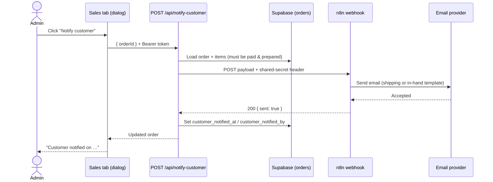

# Customer Notification via n8n

> **Status: backoffice side built (endpoint, migration, dialog, list-orders) and n8n workflow built & activated.** The order preparation flag is live (see [api.md](./api.md#post-apiset-order-prepared)). The `Lavabow — Customer Notification` n8n workflow (webhook → template → Resend → respond) is live at `https://n8n.kiwidev.fr/webhook/lavabow/customer-notification`. Remaining: fill in the two n8n credentials (webhook secret, Resend API key) and set the matching Vercel env vars — see the [implementation checklist](#implementation-checklist).

Vocabulary (Order, Prepared, Preparer, Customer notification) is defined in [`CONTEXT.md`](../CONTEXT.md).

## Decisions already made

| # | Decision |
|---|---|
| 1 | Notifying is a **separate, explicit action**, never a side effect of ticking "Prepared". |
| 2 | The action is a **"Notify customer" button in the order dialog**, shown only on **prepared** orders. |
| 3 | The server records **when** the customer was notified. The dialog shows "Customer notified on …". |
| 4 | A second send is allowed only after confirming "Already sent on X — send again?". |
| 5 | Unticking "Prepared" on a notified order is allowed, with a warning. The notification record is kept, because the email really was sent. |
| 6 | The email itself is built and sent by **n8n**. The backoffice only triggers it. |

## Flow



n8n **must respond only after the email provider accepted the message** (a synchronous workflow, using a "Respond to Webhook" node at the end). Otherwise the backoffice would record a notification that was never sent.

## Backoffice side (to build)

### Database

New migration on `orders`, following the same pattern as `prepared_at` / `prepared_by`:

| Column | Type | Meaning |
|---|---|---|
| `customer_notified_at` | `timestamptz` null | Last time a notification was successfully sent. NULL = never. |
| `customer_notified_by` | `uuid` null → `auth.users(id)` on delete set null | Admin who triggered the last send. |

These columns are **not** cleared when the order is unprepared (decision 5).

### Endpoint: `POST /api/notify-customer`

- **Auth:** `requireAdmin` (Bearer token), like `set-order-prepared`.
- **Body:** `{ "orderId": "uuid", "resend": false }`
- **Rules:**
  - `404` if the order doesn't exist.
  - `409` if the order isn't `paid`, isn't prepared, or has no customer email.
  - `409` with `{ alreadyNotifiedAt }` if it was already notified and `resend` isn't `true`. The UI turns this into the "send again?" confirmation.
  - `503` if `N8N_CUSTOMER_NOTIFICATION_WEBHOOK_URL` isn't set. The UI also hides the button in that case.
  - `502` if n8n doesn't answer `2xx` within the timeout. Nothing is recorded.
- **On success:** set both columns and return `{ order: { id, customer_notified_at, customer_notified_by, customer_notified_by_email } }`.

### UI

- **Order dialog:**
  - A "Notify customer" button under the Preparation block, visible only when the order is prepared.
  - Disabled while the request is in flight.
  - Shows "Customer notified on X by Y" once sent.
- **Unticking "Prepared"** when `customer_notified_at` is set opens a confirmation first: "The customer has already been notified. Unmark as prepared anyway?"
- **Sales table:** optionally a small "notified" icon next to the Prepared checkbox. Not decided yet, see [open questions](#open-questions).

### Environment variables (Vercel)

| Variable | Purpose |
|---|---|
| `N8N_CUSTOMER_NOTIFICATION_WEBHOOK_URL` | Production URL of the n8n Webhook node (`https://<n8n-host>/webhook/<path>`). |
| `N8N_WEBHOOK_SECRET` | Shared secret sent as the `X-Lavabow-Secret` header. n8n checks it with a Header Auth credential. |

## Contract: backoffice → n8n

### Request

`POST {N8N_CUSTOMER_NOTIFICATION_WEBHOOK_URL}`

Headers:

```
Content-Type: application/json
X-Lavabow-Secret: <N8N_WEBHOOK_SECRET>
```

Body:

```json
{
  "notificationId": "5b0c3f0e-2f7a-4f0e-9a51-1f2c7f9d8e11",
  "isResend": false,
  "order": {
    "id": "8f14e45f-ceea-467f-a0e8-2b1d6b0c9a33",
    "shortId": "8f14e45f",
    "email": "client@example.com",
    "deliveryMethod": "shipping",
    "paidAt": "2026-10-04T18:22:10.000Z",
    "preparedAt": "2026-10-06T09:41:00.000Z",
    "items": [
      { "name": "T-shirt Lavabow", "size": "M", "quantity": 1, "unitPriceCents": 2500 }
    ],
    "subtotalCents": 2500,
    "shippingCostCents": 500,
    "discountCode": null,
    "discountAmountCents": 0,
    "totalCents": 3000,
    "shippingAddress": {
      "line1": "12 rue de la Paix",
      "line2": null,
      "postalCode": "44000",
      "city": "Nantes",
      "country": "FR"
    }
  }
}
```

- `notificationId`: a fresh UUID for every click. n8n can use it to drop duplicate deliveries of the same request.
- `isResend`: `true` when the admin confirmed a second send. Lets the template add a line such as "Nous vous renvoyons ce message…" if wanted.
- `shippingAddress`: `null` when `deliveryMethod` is `in_hand`.
- Amounts are in **euro cents**, same as the database. n8n formats them for display.

### Response

| n8n answers | Backoffice does |
|---|---|
| `200 { "sent": true }` | Records the notification. |
| Any non-`2xx`, or no answer within **10 s** | Records nothing, returns `502`, and the UI shows an error toast. |

## n8n workflow

Suggested nodes, in order:

1. **Webhook**
   - Method `POST`, path e.g. `lavabow/customer-notification`.
   - Authentication: *Header Auth* credential with name `X-Lavabow-Secret` and the shared secret as value.
   - Respond: *Using "Respond to Webhook" node*.
2. **IF** `{{$json.body.order.deliveryMethod}}` equals `shipping`. Each branch builds its own email: the shipping template or the in-hand template.
3. **Set / Code**: build `subject`, `html` and `text` (templates below). Format cents to `fr-FR` EUR.
4. **Send email**:
   - Either an **HTTP Request** to Resend (`POST https://api.resend.com/emails`, `Authorization: Bearer <RESEND_API_KEY>`), reusing the verified `lavabow.fr` domain and `shop@lavabow.fr` sender already used for order confirmations;
   - or n8n's **Send Email** (SMTP) node, if another provider is preferred.
5. **Respond to Webhook**: `200 { "sent": true }`.
6. **Error path**: enable *Continue on fail* on the send node, followed by an IF on error leading to **Respond to Webhook** `502 { "sent": false, "reason": "<provider error>" }`.

### Privacy settings

The payload contains a customer's email and postal address.

- In the workflow settings, set **Save successful executions** to *Do not save*, or keep execution pruning short. Payloads then don't pile up in n8n.
- Keep failed executions saved for debugging, and prune them regularly.
- The webhook URL must be HTTPS.

## Email content (French, matches the order confirmation style)

From `Lavabow <shop@lavabow.fr>`, with reply-to `shop@lavabow.fr`.

### Shipping

- **Subject:** `Votre commande #{{shortId}} est en route`
- **Body (draft):**
  > Bonne nouvelle ! Votre commande **#{{shortId}}** a été préparée et va être expédiée à l'adresse suivante :
  >
  > {{shippingAddress}}
  >
  > Récapitulatif : {{items}}
  >
  > Une question ? Écrivez-nous à shop@lavabow.fr.

### In hand

- **Subject:** `Votre commande #{{shortId}} est prête`
- **Body (draft):**
  > Bonne nouvelle ! Votre commande **#{{shortId}}** est prête. Nous vous contacterons pour convenir de la remise en main propre.
  >
  > Récapitulatif : {{items}}
  >
  > Une question ? Écrivez-nous à shop@lavabow.fr.

## Open questions — resolved 2026-10-06

1. **Tracking number:** No — skipped for v1. No field, no column.
2. **In-hand wording:** "We'll contact you" is enough — no date/place field.
3. **Email provider:** Resend via HTTP Request node, same `lavabow.fr` domain/sender as order confirmations.
4. **n8n hosting:** self-hosted at `n8n.kiwidev.fr` (existing instance).
5. **Table indicator:** not built for v1 (still open if wanted later).
6. **Who is notified:** always the order's `email` — no admin override field.

## Implementation checklist

- [x] Answer the open questions above
- [x] Build the n8n workflow and test it (ran against both the shipping and in-hand templates, including the resend-prefix case, via n8n's test-execution with pinned payloads)
- [x] Migration: `customer_notified_at`, `customer_notified_by`
- [x] `api/notify-customer.js` (+ entry in `docs/api.md`)
- [x] Include the notification fields in `list-orders`
- [x] Dialog: Notify button, resend confirmation, "notified on" line
- [x] Unprepare warning when already notified
- [ ] Fill in the n8n credentials (see below) and set `N8N_CUSTOMER_NOTIFICATION_WEBHOOK_URL` / `N8N_WEBHOOK_SECRET` on Vercel (preview first)
- [ ] End-to-end test on a preview deploy with a real paid test order

### n8n credentials still to fill in

The workflow (`Lavabow — Customer Notification`, https://n8n.kiwidev.fr/workflow/6w7Ap0QRh6bgd5SN) is built, tested with pinned data, and activated. Two credentials need a human to type in secret values — not something that can be scripted:

1. **Webhook header secret** — the `Customer Notification Webhook` node uses a Header Auth credential ("Header Auth account" in this n8n instance). Open it and set the header name to `X-Lavabow-Secret` and the value to a strong random secret. That same value is `N8N_WEBHOOK_SECRET` on Vercel.
2. **Resend API key** — the `Send via Resend` node uses a "Templated Custom Auth" credential ("Resend API"). Set its template to `{"headers":{"Authorization":"Bearer {{api_key}}"}}` and fill `api_key` with the real Resend API key.
3. Production webhook URL for Vercel's `N8N_CUSTOMER_NOTIFICATION_WEBHOOK_URL`: `https://n8n.kiwidev.fr/webhook/lavabow/customer-notification`.

The workflow's "Save successful executions" setting is already set to "Do not save" (failed executions are kept for debugging) since the payload carries the customer's email and address.
